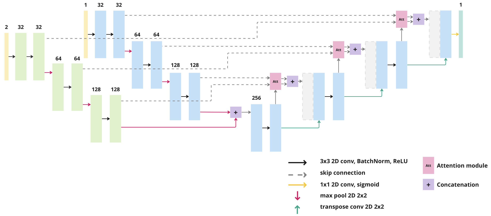

# Method for Segmentation of Vestibular Schwannomas from Brain MRI Scans
The main idea behind this work was to train the primary segmentation network on the least amount of fully annotated images possible and then correct the imperfect segmentations by using user-defined clicks.

<!--
 <p align="center">
  
  <br/>
  <i>method diagram</i>
</p>
-->

The correction is based on an auxiliary correction network, which refines the initial (imperfect) segmentations based on the provided clicks. In general, the refinement is done on a local level, where the clicks denote an area of the initial segmentations that need to be corrected. 

<!--
The architecture of the correction network is based on a U-Net architecture with separate encoders.

 <p align="center">
  
  <br/>
  <i>architecture of the correction network</i>
</p>
-->

We also designed a custom loss function. The loss fuction is based on the Dice loss but adds an additional weighting factor which gives higher weights to the areas denoted by the clicks.

<!-- the \limits is a workaround, since github doesnt display the sums properly :/-->
$$
L_{corr} = 1 - 2 \frac{\sum\limits_{i=1}^{W} \sum\limits_{j=1}^{H} (p_{i,j} \cdot y_{i,j} \cdot w_{i,j})}{\sum\limits_{i=1}^{W} \sum\limits_{j=1}^{H} ((p_{i,j} + y_{i,j}) \cdot w_{i,j})}
$$

<p align="center"><i>Correction loss</i></p>

With this method, we were able to achieve mean dice score of 0.863 on the testing set by utilising only 20% of the fully-annotated samples. In contrast, state-of-the-art fully supervised approaches achieve a Dice score of around 0.920.

<p align="center">
  
  <br/>
  <i>sample results</i>
</p>

## Setup
The training and evaluation scripts were built for the Azure ML services, so the workflow outside the Azure services might feel a little sluggish and was not properly tested. 

We however prepared a demo jupyter notebook, `demo.ipynb`, which demonstrates our pipeline.

### Try it locally
set up a virtual environment with:
```sh
python3 -m venv venv
```

activate the virtual environment:
```sh
source venv/bin/activate
```

install the requirements:
```sh
pip install -r requirements.txt
```
